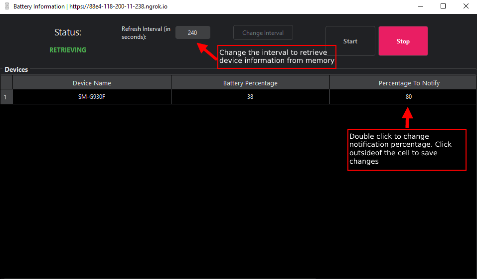

# BatteryTrackerServer

BatteryTrackerServer is a service that reduces the possibility of overcharging your device by tracking its battery level periodically.

This repository contains the backend server of the BatteryTrackerServer.

**NOTE:** This service is designed for **personal use only**. The service contains little to no security features like
device authentication.

## Features

- Receive device's information (`device id`, `name` & `battery level`) via REST API
- Monitor device's battery level via a GUI interface periodically _(default: four minutes)_
- Notify you to unplug your charged device when the battery level reaches a specific level _(default: 80%)_.



## Installation

Clone the project

```bash
  git clone https://github.com/TryingOutSomething/BatteryTrackerServer.git
```

Go to the project directory

```bash
  cd BatteryTrackerServer
```

Install dependencies with pip

```bash
  pip install -r requirements.txt
```

Rename the dotenv file, `.env_sample` to `.env` with the following key value pair:

```
USE_NGROK=True # True if using Ngrok to proxy the ip address. Else, False
```

Start the app

```bash
  python3 main.py
```

## API Reference

#### Register Device

```http
  POST /device/register
```

| Parameter       | Type     | Description                                                                                            |
| :-------------- | :------- | :----------------------------------------------------------------------------------------------------- |
| `device_id`     | `string` | **Required**. Unique id to identify your device                                                        |
| `device_name`   | `string` | **Required**. Name of your device                                                                      |
| `battery_level` | `string` | **Required** **Required**. Your device's current battery level. (Only supply the **numerical values**) |

#### Unregister Device

```http
  DELETE /device/unregister
```

| Parameter   | Type     | Description                                               |
| :---------- | :------- | :-------------------------------------------------------- |
| `device_id` | `string` | **Required**. Unique id to identify your device in memory |

#### Send Battery Level

```http
  PUT /battery_level/update
```

| Parameter               | Type     | Description                                                                               |
| :---------------------- | :------- | :---------------------------------------------------------------------------------------- |
| `device_id`             | `string` | **Required**. Unique id to identify your device                                           |
| `current_battery_level` | `string` | **Required**. Your device's current battery level. (Only supply the **numerical values**) |

### Response

The response from the server contains the following parameters to provide the client with more information about their
request:

| Parameter      | Type     | Description                           |
| :------------- | :------- | :------------------------------------ |
| `service_code` | `string` | The status of the requested operation |
| `message`      | `string` | Error messages if any                 |

Refer to [response.py](api/utils/response.py) in `api/utils` directory to view learn more about the service codes implemented.

## Contributing

Feel free to edit the project and submit a pull request or open an issue on github to leave a feedback

## License

[MIT](https://choosealicense.com/licenses/mit/)

## FAQ

#### Why does this project exist in the first place?

As I do not have enough wall outlets near my working area, I have to get up and walk into another room to plug my
smartphone into wall outlet charger whenever I want to charge my smartphone.

With the fear of overcharging my smartphone, I have to constantly get up and check my smartphone. This process is time-consuming and I tend to forget that my smartphone is charging in the other room.

This system allows me to monitor my smartphone's battery level while I am doing my work on my computer and notify me
when my smartphone is done charging.

#### How do I customise the GUI?

The GUI was built using PySide6. After installing the package, run `pyside6-designer` in the terminal to customise the GUI.

Save the changes to `gui/design_template` directory as `interface_design.ui` and run the `ui_to_python_converter.py` to implement the changes to the GUI.

## Attributions

Icons used to create the logo:

- [Made by Premium](https://www.flaticon.com/authors/made-by-made-premium) from [FlatIcons](https://www.flaticons.com)
- [DinosoftLabs](https://www.flaticon.com/authors/dinosoftlabs) from [FlatIcons](https://www.flaticons.com)
